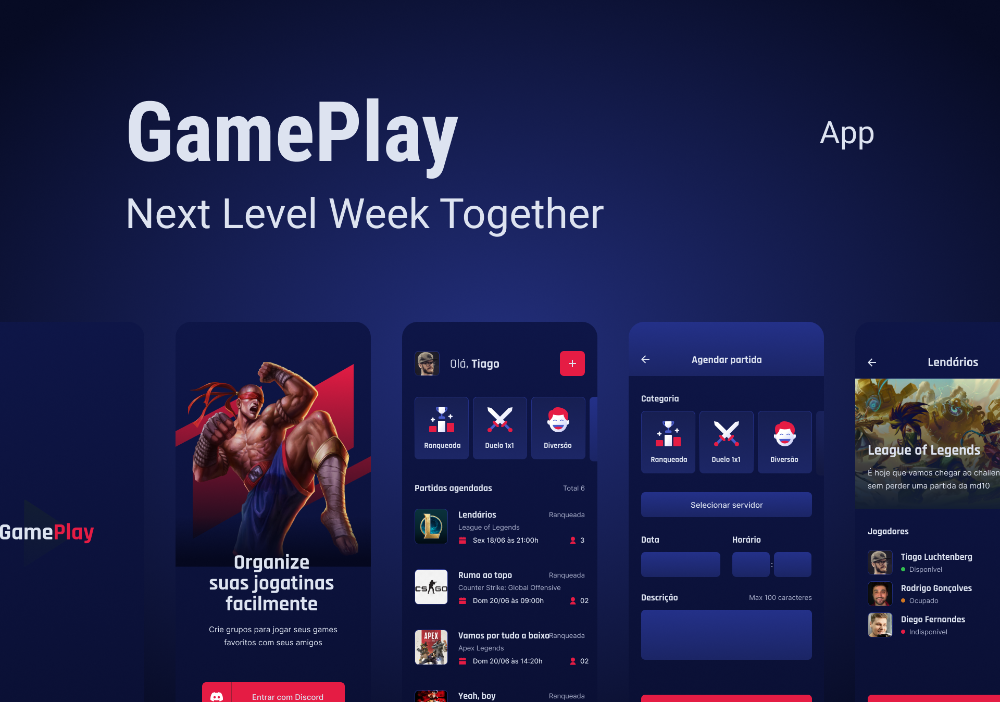

	

<h1 align="center">GamePlay</h1>

Aplicativo mobile desenvolvido em React Native com Expo, durante uma edição da NLW realizada pela <a href="https://www.youtube.com/rocketseat">Rocketseat</a>. Contêm diversas funções, como autenticação e consumo de dados pela API do Discord, armazenamento de dados no dispositivo do usuário, compartilhamento e utilização de hiperlink e vários outros recursos visuais e funcionais.

Em construção... 🚧🛠️

